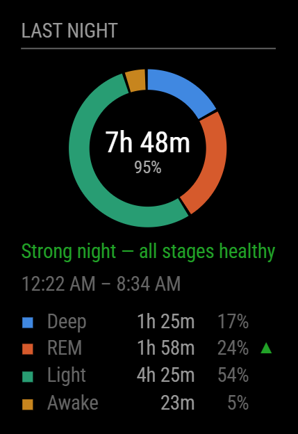

# MMM-FitbitAir


A [MagicMirror²](https://magicmirror.builders/) module that puts **last night's sleep** on your mirror — total time asleep, efficiency, and the deep/REM/light/awake breakdown.

Built for the **[Google Fitbit Air](https://blog.google/products-and-platforms/devices/fitbit/fitbit-air/)**, the screenless tracker that has no display of its own — but works with **any device that syncs sleep to the Google Health app**, including Pixel Watch, Wear OS watches, and older Fitbits (Charge, Sense, Versa, Inspire).



A donut chart carries the stage breakdown, with total sleep in the centre, and each stage is checked against typical adult ranges so the numbers actually mean something. A monochrome mode is available for heavily tinted mirror glass, which mutes hue but not brightness.

---

## Why this module exists

If you searched for a Fitbit MagicMirror module, you probably found [`MMM-fitbit`](https://github.com/SVendittelli/MMM-fitbit) — last updated in 2016. It targets the **legacy Fitbit Web API, which Google is shutting down in September 2026.** Anything built on it stops working.

Google's replacement is the [**Google Health API**](https://developers.google.com/health) (`health.googleapis.com`), and it's where Fitbit Air, Pixel Watch, and Wear OS sleep data now lives. This module targets that new API.

The Fitbit Air is a particularly good fit: it's **screenless by design**, so the device itself never shows you anything — your stats only exist in the Google Health app. A mirror is a natural place to surface them.

**How to tell if this module works for you:** open the **Google Health** (or Google Fit) app and check that last night's sleep is there. If it is, you're set.

---

## ⚠️ Read this first: the 7-day re-authorization

Sleep data lives behind `googlehealth.sleep.readonly`, which Google classifies as a [**restricted scope**](https://support.google.com/cloud/answer/13464325).

**For any app that hasn't gone through Google's formal verification, refresh tokens expire after 7 days.** This is a Google policy, not a bug in this module, and there is no way to configure around it.

Getting rid of the 7-day limit would require:

- Publishing the app and passing Google's OAuth verification, **plus**
- A [**CASA Tier 2/3 security assessment**](https://developers.google.com/identity/protocols/oauth2/production-readiness/restricted-scope-verification) from a Google-approved third-party assessor — which costs money, takes weeks, and must be **redone every 12 months**.

That's aimed at companies, not someone putting a widget on a bathroom mirror. So this module is designed to make the weekly reconnect as painless as possible instead: **the mirror shows a QR code when it needs you, and reconnecting is scan → sign in → one tap.** Roughly 20 seconds, once a week.

> If your Google account is part of a **Google Workspace** organization, you can set the OAuth app to "Internal" and skip verification entirely — no 7-day expiry. This only works for Workspace accounts, not personal Gmail.

---

## Installation

### 1. Clone the module

```bash
cd ~/MagicMirror/modules
git clone https://github.com/Hkattelu/MMM-FitbitAir.git
cd MMM-FitbitAir
npm install
```

Requires Node.js 20 or newer (MagicMirror² itself already requires 20+).

### 2. Set up Google Cloud

You need your own OAuth credentials — Google requires each user to register their own app for restricted scopes.

1. **Create a project**
   Go to the [Google Cloud Console](https://console.cloud.google.com/) and create a new project (any name, e.g. `magicmirror-sleep`).

2. **Enable the Health API**
   In your project, go to **APIs & Services → Library**, search for **"Google Health API"**, and click **Enable**.

3. **Configure the OAuth consent screen**
   Go to **APIs & Services → OAuth consent screen**:
   - **User type:** External
   - **App name:** anything (e.g. `Mirror Sleep`)
   - **User support email / developer contact:** your email
   - Leave the publishing status as **Testing** — do *not* submit for verification (see the warning above).

4. **Add the scope**
   Under **Data Access** (or **Scopes**), add:
   ```
   https://www.googleapis.com/auth/googlehealth.sleep.readonly
   ```

5. **Add yourself as a test user**
   Under **Audience** (or **Test users**), add the Google account whose sleep data you want to display. **If you skip this, authorization will fail.**

6. **Create the OAuth client**
   Go to **APIs & Services → Credentials → Create Credentials → OAuth client ID**:
   - **Application type: Web application** ← this matters, see below
   - **Authorized redirect URI:** `https://www.google.com` (exactly this)
   - Click **Create**, then copy the **Client ID** and **Client Secret**.

   > **Why "Web application" and not "TVs and Limited Input devices"?**
   > The device flow looks like the natural fit for a headless Raspberry Pi, but Google rejects it for this scope — requesting it returns `invalid_scope`. Google's own [Health API setup docs](https://developers.google.com/health/setup) specify a web client. Since a mirror on your home network can't host a public HTTPS callback, we register `https://www.google.com` as the redirect and pull the authorization code out of that page (see [Reconnecting](#reconnecting-weekly)).

### 3. Add your credentials

```bash
cp google-credentials.json.sample google-credentials.json
chmod 600 google-credentials.json
```

Then edit it:

```json
{
  "client_id": "123456789-abcdef.apps.googleusercontent.com",
  "client_secret": "GOCSPX-your_secret_here"
}
```

`google-credentials.json` and `token.json` are both gitignored — they will never be committed.

### 4. Add the module to your config

In `~/MagicMirror/config/config.js`:

```javascript
{
  module: "MMM-FitbitAir",
  position: "top_right",
  header: "Last Night",
  config: {
    // all options are optional; these are the defaults
    updateInterval: 3600000,
    authPort: 8091,
    showStages: true,
    showEfficiency: true,
    showTimes: true
  }
},
```

Then restart MagicMirror (`pm2 restart MagicMirror`, or however you run it).

### 5. Set up the reconnect bookmarklet (one time)

On the **phone you'll use to reconnect**, create a bookmark with this as the URL — replacing `192.168.1.187` with your mirror's IP address:

```javascript
javascript:(function(){var c=new URLSearchParams(location.search).get('code');if(!c){alert('No authorization code on this page. Run this on the google.com page you land on after approving access.');return;}location.href='http://192.168.1.187:8091/submit?code='+encodeURIComponent(c);})();
```

<details>
<summary>How to save a bookmarklet on mobile</summary>

**iOS Safari:** Bookmark any page, then edit the bookmark and replace its URL with the code above.

**Android Chrome:** Add any page to bookmarks, then edit the bookmark and replace the URL.

Name it something obvious like "Connect Mirror".
</details>

The readable, commented source is in [`bookmarklet.js`](bookmarklet.js).

---

## Reconnecting (weekly)

When the token expires, the mirror replaces the sleep display with a **QR code**. To reconnect:

1. **Scan the QR code** with your phone (or open the link it encodes).
2. **Sign in** and approve access. Google will warn that the app isn't verified — that's expected for a personal app; choose **Advanced → Go to \<your app\> (unsafe)**.
3. You'll land on a normal **google.com** page. **Tap your "Connect Mirror" bookmarklet.**
4. Done — the mirror refreshes within a few seconds.

The mirror detects the expiry on its own and shows the QR code without any restart.

---

## Configuration options

| Option | Type | Default | Description |
|---|---|---|---|
| `updateInterval` | number | `3600000` | How often to poll, in ms. Sleep data changes once a day, so hourly is plenty. |
| `authPort` | number | `8091` | Port for the LAN-only endpoint the bookmarklet posts to. Change if it conflicts; update your bookmarklet to match. |
| `lookbackDays` | number | `14` | How many nights back to search for the most recent session. If the newest session isn't from last night, the mirror shows it labelled with its age rather than showing nothing — useful when a device hasn't synced yet. |
| `showChart` | boolean | `true` | Draw the donut chart, with total sleep in its centre. Falls back to plain text if your device reports no stages. |
| `useColor` | boolean | `true` | Colour the donut by stage. Set `false` for a monochrome ring that separates stages by brightness instead — worth trying behind heavily tinted mirror glass, which mutes hue but not brightness. |
| `showGuidance` | boolean | `true` | Compare each stage against typical adult ranges and add a one-line read on the night. See [Is my sleep any good?](#is-my-sleep-any-good) |
| `stageRanges` | object | see below | Reference ranges, as `{ deep: [min, max], … }` percentages. |
| `idealSleepHours` | array | `[7, 9]` | Target nightly sleep, in hours. |
| `minEfficiency` | number | `85` | Sleep efficiency below this reads as a restless night. |
| `showStages` | boolean | `true` | Show the deep/REM/light/awake breakdown. Doubles as the chart's legend, adding percentages. Hidden automatically if your device doesn't report stages. |
| `showEfficiency` | boolean | `true` | Show sleep efficiency percentage. |
| `showTimes` | boolean | `true` | Show bedtime and wake time. |

---

## Is my sleep any good?

A stage breakdown doesn't help much if you don't know what a normal one looks like. With `showGuidance` on, each stage is checked against typical adult ranges, a `▲` or `▼` marks anything outside its band, and a one-line summary sits under the chart.

| | Typical range | Measured against |
|---|---|---|
| Deep | 13–23% | total sleep time |
| REM | 20–25% | total sleep time |
| Light | 45–55% | total sleep time |
| Awake | under 5% | total time in bed |
| Sleep efficiency | 85% or higher | time asleep ÷ time in bed |
| Total sleep | 7–9 hours | adults aged 18–64 |

A few deliberate choices:

- **More deep sleep or REM reads as good** (a green `▲`), not as an anomaly. Only *low* deep/REM, excess time awake, a short night, or low efficiency are flagged.
- **Light sleep is never flagged.** It's the remainder — it goes up when the others go down, and saying so twice adds nothing.
- **Only two states exist**, "fine" and "worth noticing". Sleep varies enough night to night that anything more alarming would overstate what a wrist tracker can tell you.
- **Percentages in the legend are shares of the whole night** (so they match the ring), but the range checks use total *sleep* time, which is the basis the published figures use. On a restless night the two differ noticeably.

> [!NOTE]
> These are general population reference ranges, not medical advice, and they shift with age — deep sleep in particular declines steadily through adulthood. If your numbers look off to you, that's a conversation for a doctor, not a mirror. Every range is configurable via `stageRanges`, `idealSleepHours`, and `minEfficiency`.

Ranges follow standard sleep-medicine distributions (N1 3–8%, N2 45–55%, N3 15–20%, REM 20–25%), the [Sleep Foundation](https://www.sleepfoundation.org/stages-of-sleep/deep-sleep)'s adult deep-sleep figures, the clinical 85% [sleep efficiency](https://en.wikipedia.org/wiki/Sleep_efficiency) threshold, and the National Sleep Foundation's 7–9 hour recommendation.

---

## Troubleshooting

**`invalid_scope` when authorizing**
Your OAuth client is the wrong type. It must be **Web application**, not "TVs and Limited Input devices" or "Desktop app". Create a new client with the right type.

**`invalid_grant` in the logs, or the QR code reappears after ~a week**
This is the expected 7-day expiry. Just reconnect — nothing is broken.

**"Google did not return a refresh token"**
Google only issues a refresh token on a fresh consent. Revoke the app at [myaccount.google.com/permissions](https://myaccount.google.com/permissions), then authorize again.

**"Access blocked: app not verified"**
Expected for a personal app in Testing mode. Choose **Advanced → Go to \<app name\> (unsafe)**. If you don't see that option, make sure you added your account under **Test users**.

**"No sleep recorded last night"**
No sessions at all within `lookbackDays`. Open the Google Health app and confirm your sleep is actually there — the API only ever sees what that app has.

**It says "N nights ago — device hasn't synced since"**
Working as intended: that's the newest session the API has. The Fitbit Air uploads over Bluetooth when the app is opened, so if you haven't opened Google Health in a while, the data simply hasn't left the tracker yet. Open the app to force a sync.

**Bookmarklet does nothing / can't connect**
Your phone must be on the same network as the mirror, and the IP and port in the bookmarklet must match your mirror and `authPort`.

---

## Development

```bash
npm test
```

Tests cover the Health API response parsing (stage totals, efficiency, session selection, and malformed-payload handling) with no network access required.

---

## License

MIT © [Hkattelu](https://github.com/Hkattelu)
